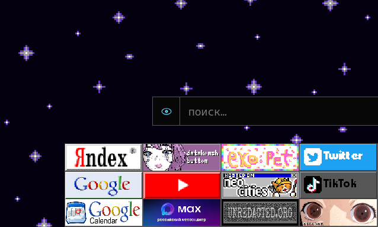

# golyb://home

Персональная стартовая страница с поиском и настраиваемыми кнопками-ссылками.

## Возможности

- Добавление, редактирование, удаление и перетаскивание кнопок; поддерживаются изображения и GIF.
- Настраиваемые поисковики, прямой переход по URL и история поиска.
- Выбор фонового цвета или изображения.
- Экспорт и импорт настроек в JSON. В меню импорта также можно загрузить JSON из папки `import/` публичного GitHub-репозитория.

Настройки сохраняются в локальном хранилище браузера. Файлы конфигураций проекта находятся в `import/`.